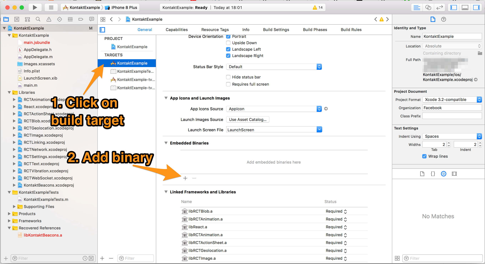
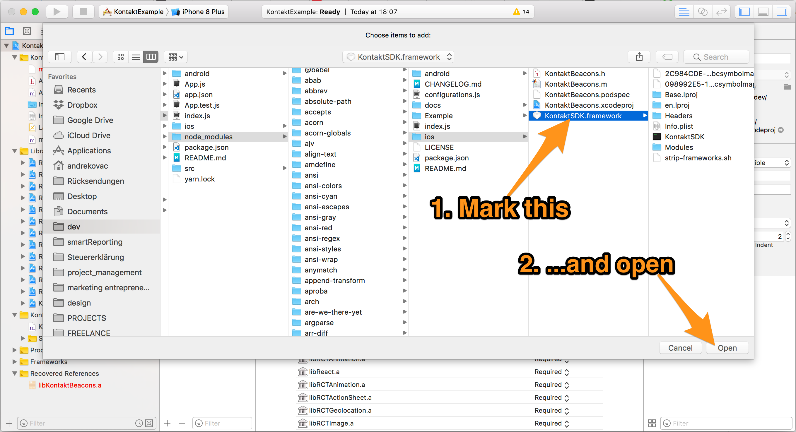
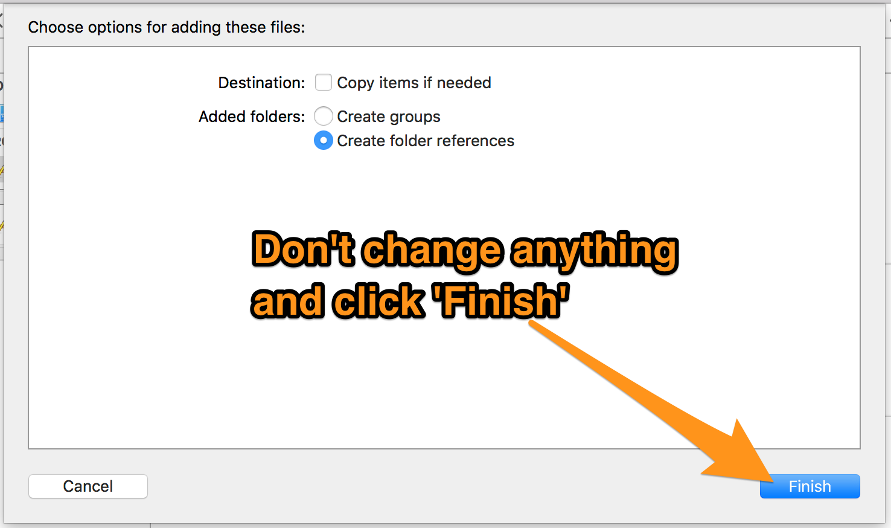
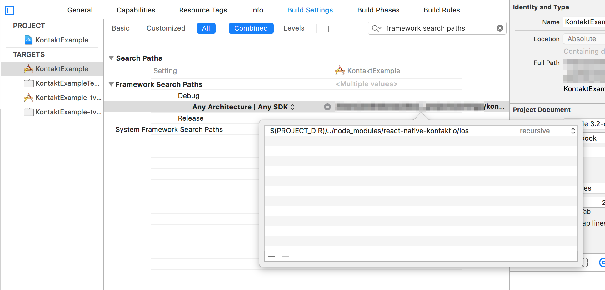
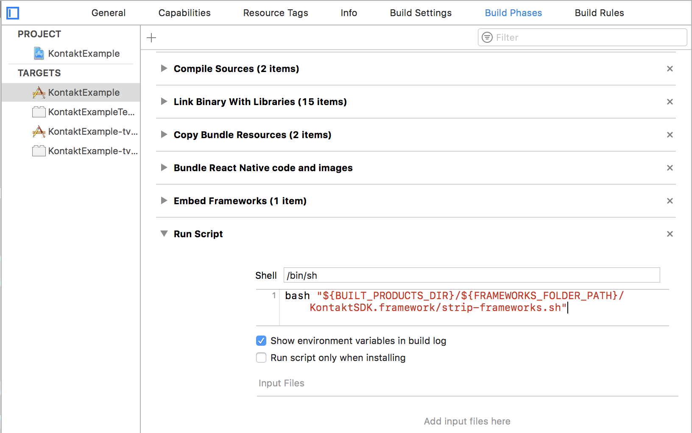
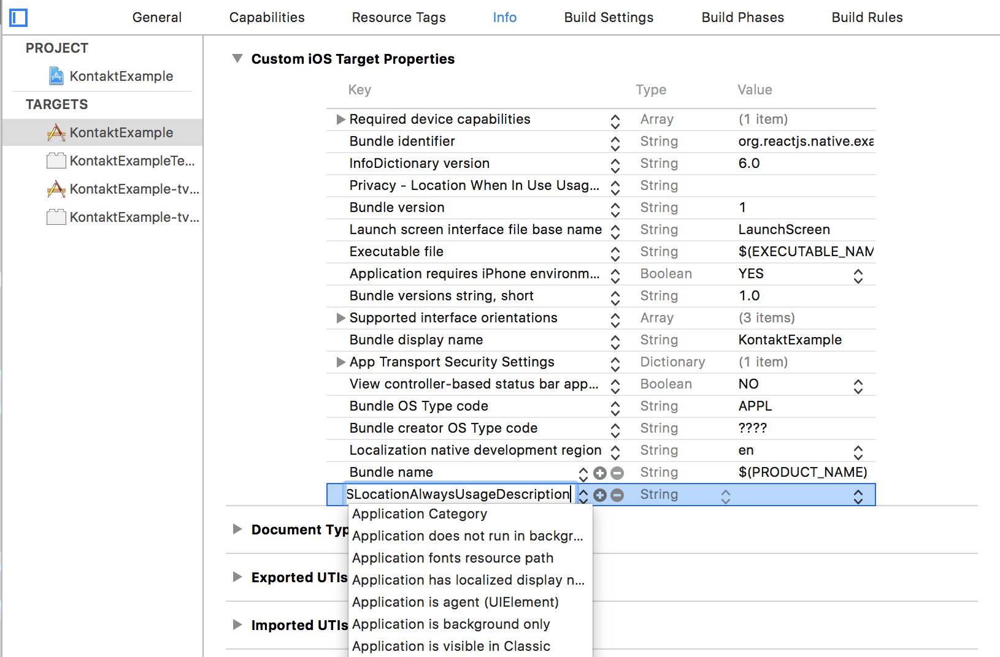
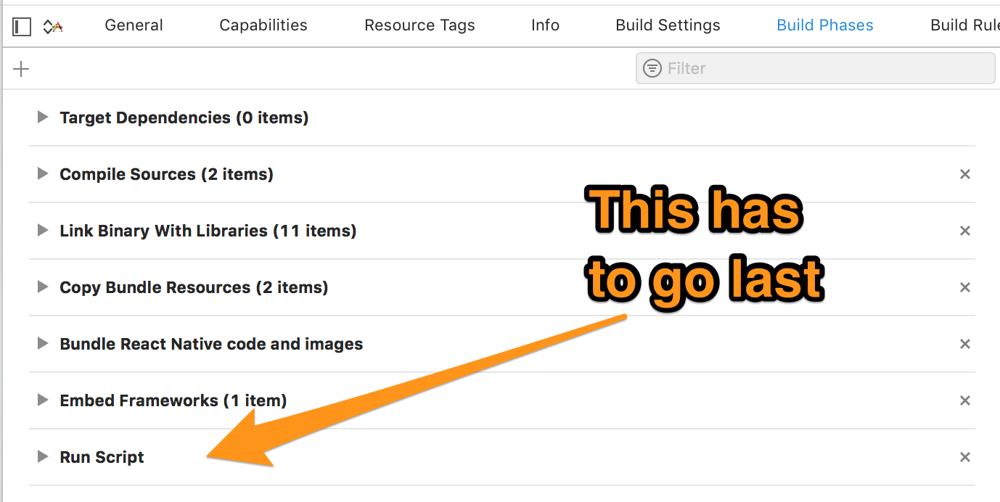

# iOS Setup

Some [Kontakt.io beacons prerequisites](https://developer.kontakt.io/android-sdk/quickstart/#setup) have to be met.

## Mostly automatic setup (recommended)

When installing both, Android and iOS, steps _1_ and _2_ only have to be run once for both platforms.

1.  Install the package

    - `yarn`

      	```bash
      	$ yarn add react-native-kontaktio
      	```

    - `npm`

      	```bash
      	$ npm install --save react-native-kontaktio
      	```

2.  Link module (use `rnpm` for React Native versions older than `0.27`)

        react-native link react-native-kontaktio

3.  Manually link **Kontakt.io SDK**

    - Open the projects workspace in **XCode**

      	```
      	open ios/MyProjectName.xcodeproj
      	```
    - Select your build target in the **`Project navigator`**. Click **`General`** and then in the **`Embedded Binaries`** section, click the **`+`** button.

    	

    - Click **`[Add Other...]`**.
    - Navigate to **`node_modules/react-native-kontaktio/ios`**.

		

    - Add **`KontaktSDK.framework`**.
    - Leave the selection as is (don't copy to destination)

    	

    It should now also appear both in the **`Embedded Binaries`** section as well as in the **`Linked Frameworks and Libraries`** section below it.

4.  Add Framework Search paths so that Xcode can find the added framework

    - Go to the **Build Settings** tab and search for **"framework search paths"**.
    - Add the following to _Framework Search Paths_ (select **recursive [v]**):

      	```
      	$(PROJECT_DIR)/../node_modules/react-native-kontaktio/ios
      	```

      

5.  Add run script

    - In the **`Build Phases`** tab, click the **`+`** button at the top and select **`New Run Script Phase`**. Enter the following code into the script text field:

    ```
    bash "${BUILT_PRODUCTS_DIR}/${FRAMEWORKS_FOLDER_PATH}/KontaktSDK.framework/strip-frameworks.sh"
    ```
    


6.  Add permissions

    Go to the **Info** tab and add in the top section **`Custom iOS Target Properties`** add either one of the following permissions:

    | Key                                 | Value                                    | Description                                                                           |
    | ----------------------------------- | ---------------------------------------- | ------------------------------------------------------------------------------------- |
    | NSLocationWhenInUseUsageDescription | Your text of the permission for the user | A message that tells the user why the app is requesting access to the user’s location information while the app is running in the foreground. [See documentation for more information](https://developer.apple.com/documentation/bundleresources/information_property_list/nslocationwheninuseusagedescription) |
    | NSLocationAlwaysUsageDescription    | Your text of the permission for the user | A message that tells the user why the app is requesting access to the user’s location information at all times (i.e. even when the app is in the background). **DEPRECATED** in iOS versions later than 10.0 [See documentation for more information](https://developer.apple.com/documentation/bundleresources/information_property_list/nslocationalwaysusagedescription) |
    | NSLocationAlwaysAndWhenInUseUsageDescription | Your text of the permission for the user | A message that tells the user why the app is requesting access to the user’s location information at all times. [See documentation for more information](https://developer.apple.com/documentation/bundleresources/information_property_list/nslocationalwaysandwheninuseusagedescription) |

	Just copy-paste the key from here and the text will automatically change to the more elaborate version when you press enter:

	

---

## Known Issues

* In case you run into the build error `Command PhaseScriptExecution failed with a nonzero exit code` check whether the `Run Script` in the `Build Phases` section is the last entry. If not, drag the `Run Script` down so that it is.

    
